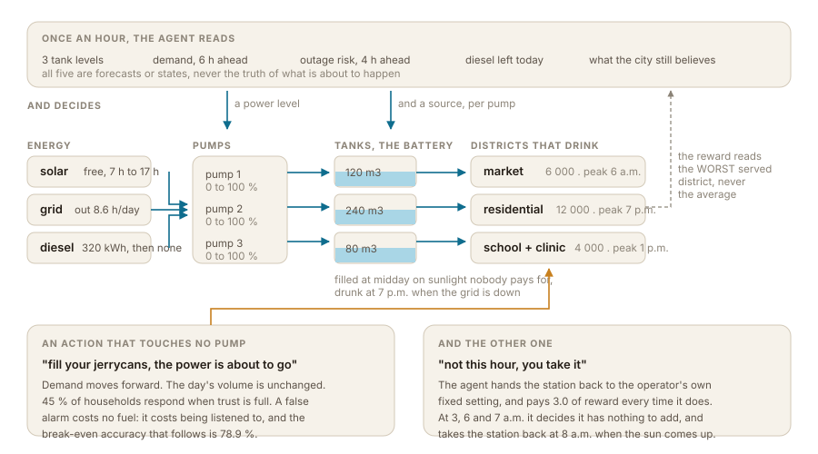

# WIIGA

**In most cities, the water pumps simply run. All of them, all day, so that
water is always there. WIIGA asks a different question: what if we brought the
water where it is needed, when it is needed, on the cleanest power available at
that moment?**

WIIGA builds a digital twin of a city's water network, then decides - every hour,
for every district - **which pump runs, at what power, filling which tank, on
which source of energy.** It reads the date, the hour, the temperature, the
season and the district, and it prefers solar every time solar can do the job.
Grid second. The diesel generator last, and only when there is nothing else.

## The whole thing in one minute

**Live demo:** <https://sorghobrayan-dotcom.github.io/WIIGA/> - one static file, no
server, no network request. Drag the hour to 1 p.m., then to 7 p.m., and the
argument is made in two moves.

| | |
|---|---|
| **The problem** | Ouagadougou's grid was out **14 hours a day** in April 2024, hardest in the evening - exactly when a residential district wants water. |
| **What it does** | A PPO agent operates three pumps, three tanks and three energy sources, hour by hour, and can also warn the city or hand the hour back to the operator. |
| **What is new** | The reward reads the **worst-served district**, not the average. And one action spends **credibility** instead of energy. |
| **What it buys** | **67 % fewer dry hours** on the worst district than the best hand-written rulebook, **48 % less CO2** than current practice, **148 455 person-days a year** above the WHO survival threshold. |
| **Where it fails** | Above 366 L of diesel a day. On the market district. And a CVaR variant we built collapsed outright. All three are published below. |

**And the object is not really water.** It is *operating an essential service on
infrastructure that cannot be relied on* - the same problem as a vaccine cold
chain, a rural health battery, or a motorbike charging network in the same city.
Water is where we could measure it.



Three moments from one simulated day - **30 March, 39.8 C**, the median day of
the hot dry season and the day the demo opens on. They are the whole project.
Every figure below is what the live demo replays hour by hour in front of you,
and `python -m wiiga.journee` prints the same four lines in your terminal.

**1 p.m. - it fills the tanks on sunlight it does not pay for.** All three pumps
at 100 %, all three on solar. Nobody in the city is thirsty at 1 p.m.; the agent
is not serving demand, it is **storing work already done**. The tank is the
battery, and it costs nothing to build because it is already there.

**7 p.m. - peak demand, grid down, sun gone, and it barely pumps.** Pumps at
0 %, 7 %, 0 %. It does not need to: the worst district is at 57 % and nobody
goes dry. It did not react to the evening. It prepared for it at midday.

**3 a.m. - it hands the station back.** This is the one we did not expect. The
agent has an action that means *not this hour, you take it*, and it costs 3.0 of
reward every time it uses it. At 3 a.m. it pays that price and lets the
utility's own fixed setting run - which pumps at full power on the night grid
and takes the tanks to 0.90. It does the same at 6 and 7 a.m., then takes
control back at 8 a.m., when the sun comes up and the arbitrage starts to
matter.

**It learned when it is useless.** At night there is no sun to trade, no peak to
anticipate, no outage to fear, and the fifty-year-old fixed setting is simply the
right answer. So it steps aside and pays for the privilege. For an operator, that
is the opposite of the thing they fear about tools like this: it is not software
taking the station, it is software that hands it back and says when it has
nothing to add.

That is the whole idea. Everything below is either how it works, or proof that
it works.

---

## The worst day of the year

The demo opens on the median day of the hot dry season. This is the other end of
that season - the single day, out of 365 replayed, where the agent brings the
most.

**25 February. 38.7 C. The grid fails every evening and the city is at its
thirstiest.**

On that day the hand-written rulebook leaves 222 256 litres unserved -
**11 113 people below the WHO survival threshold of 20 litres. Half the city.**

The agent, same day, same outages, same sunshine, same demand: **546 people.**

**A difference of 10 566 people, in a single day.**

That is not the average day, and it is named as the extreme it is. The point is
where the extremes sit: the five largest gaps of the year are all in the hot dry
season, between 37.8 and 39.8 C, and **96 % of everything the agent spares the
city over a year falls in that one season.** Its value does not spread evenly
across the calendar - **it concentrates exactly on the days the city can least
afford.**

Both this day and the demo's are printed, with the ranking behind them, by:

```bash
python -m wiiga.journee
```

---

## The three things that make this different

### 1. The tank is the battery

Solar power is free at 1 p.m. and gone by 7 p.m., which is exactly when the
residential district gets thirsty. Storing that energy would mean lithium -
expensive, and due for replacement in eight years.

But the storage is already on site. It is the **tank**. Pumping at midday, on
free sunlight, into a district that consumes nothing at midday is not waste: it
is storage. You are not storing electricity, you are storing work already done.

This is also what makes learning necessary rather than decorative. To decide
whether to fill *now*, the agent must hold four things together that do not
arrive at the same time: the district's peak six hours out, the sun's arc, the
risk of a grid cut this evening, and the diesel that is left. A hand-written
rule does not arbitrate four horizons - and we measured that, against a rule
that reads the same forecast the agent does.

### Why a threshold cannot do this job

The hand-written rulebook reads the same outage forecast the agent does and fires
an "urgent" flag above a risk threshold. Sweeping that threshold over a 6x5 grid
barely moves anything: from 0.05 to 0.60, the rulebook lands between 0.71 and
0.85 dry hours a day, and most of the grid is flat to the second decimal.

That is not a badly chosen constant. It is a property of the information itself.
Measured over the same 8 760 forecast hours the rule was scored on, the risk of
an outage in the next four hours has a median of **0.046** across the year and
**0.585** in the hot dry season - the signal is bimodal. 59 % of hours sit below
0.1 and 35 % sit above 0.6; **0.5 % of them fall between 0.2 and 0.5**, which is
the only zone a threshold has anything to arbitrate. Moving the threshold from
0.15 to 0.60 - a factor of four - changes how often the rule declares an
emergency by **4.2 percentage points**, because there is almost nothing in
between to reclassify.

```bash
python -m wiiga.prevision
```

That prints the medians, the two thresholds and the histogram the sentence above
describes.

A scalar threshold on a bimodal signal has exactly two states. The agent reads
the same forecast as a vector, alongside tank levels, sunshine, the seasonal
demand multiplier and the fuel left, and can be at 40 % on one pump and 90 % on
another in the same hour. **That is the difference the numbers measure**, and it
is why the gap survives giving the rule its best possible constants.

### 2. The reward reads the worst-served district, not the average

`min`, not `mean`. One line, and it carries the whole project.

With an average, draining one district to keep two full is an excellent policy.
It is also unacceptable. Every number in the results table below comes from an
agent that was optimised for the district doing worst - which is why it is more
expensive than it could be, and why that is the point.

### 3. The agent can talk to the city

The agent has one action that touches no pump: **warn the city to fill their
jerrycans before the cut.** SMS, neighbourhood radio, the market crier - the
channel does not matter, the mechanism does.

This action does not exist in the pump-scheduling literature, for a reason that
is not technical: **in Europe nobody stores water at home.** Published demand
response shifts industrial load through pricing. Here every household has
jerrycans, and one sentence at 5 p.m. moves more water than an hour of diesel.

Three properties make it a genuine learning problem rather than a button:

- **Warning moves demand forward, it does not remove it.** Households draw now
  what they would have drunk later. The tank is therefore under *more* strain in
  the following hour and less during the cut. Total volume is conserved exactly.
- **The cost of the action is the future effectiveness of that same action.** A
  false alarm costs no fuel and no money. It costs being listened to.
- **Credibility is lost far faster than it is earned.** A correct warning buys
  +0.04 of trust; a false one costs -0.15. That asymmetry alone fixes a
  break-even accuracy of **78.9 %**, and the agent has to learn to stay above it.

There is no penalty term forbidding the agent to chatter. Talking too often is
simply a losing bet, and it has to work that out.

**Both halves of the number, because precision alone flatters.** Over a year the
agent speaks 0.70 times a day and is right **96 %** of the time - that is
precision. The other half is recall: it warns before **173 of the 641 outage
episodes**, so **73 % of outages happen with nobody warned.** That is not an
oversight, it is the operating point the credibility economy forces. Below 78.9 %
accuracy trust collapses and the channel dies, so the agent buys precision by
giving up coverage. A version that warned before every outage would be believed
by no one by the end of the month.

**And the speech is not decoration.** The same weights with the warning switched
off - same seeds, same days, one component of the action vector forced to zero -
leave **45 % more dry hours** (0.227 against 0.156) and cost **8 % more** to run
(290 705 against 268 745). It earns its place in the story, not just in the table.

One structural rule makes that learnable: **the broadcaster does not re-send
while the previous warning is still awaiting judgement** - which is what any real
alerting system does. Without it, measured, two seeds on the same reward found
opposite degenerate optima: one never spoke at all, the other shouted seven times
a day and lost all credibility by day 14 despite being right 87 % of the time.
With it, one decision remains - *when* to spend a warning.

---

## Running it

```bash
pip install -r requirements.txt
```

```bash
python -m wiiga.resultats --journees 365
```

That reproduces the tables in this file and writes
`resultats/comparaison.json`. The day the demo opens on, the worst day of the
year and the ranking behind them come from:

```bash
python -m wiiga.journee
```

Every measurement command loads `agents/graine_0`, the median of the three
trainings in `graines.json` - that is the model every published figure is
measured on, and it is the default so that the command above and the tables
below cannot drift apart. Training from scratch takes about fifteen minutes on a
laptop CPU and writes `wiiga_agent`, which you then have to ask for by name:

```bash
python -m wiiga.train --pas 600000
```

```bash
python -m wiiga.resultats --journees 365 --modele wiiga_agent
```

Point the model at any city on earth - no API key, no account:

```bash
python -m wiiga.ville Chennai
```

Geocoding and three years of daily ERA5 records come from Open-Meteo and are
cached to `villes/` so the demo runs offline afterwards.

---

## Results

<!-- chiffres:début -->

*365 simulated days, one per day of the year, identical seeds for every policy. Measured on 2026-08-14, regenerated by `python -m wiiga.resultats --journees 365`.*

### What each policy costs the city

| operator | dry hours / day | dry days / 200 | local currency / day | L diesel / day | kg CO2 / day | tank low point |
|---|---:|---:|---:|---:|---:|---:|
| what the utility runs today | 2,48 | 77 | 961 761 | 77,0 | 206,4 | 0,27 |
| cheapest source, no forecast | 0,40 | 30 | 324 656 | 61,2 | 164,0 | 0,41 |
| hand-written rulebook | 0,33 | 26 | 321 557 | 62,8 | 168,3 | 0,43 |
| **WIIGA agent** | 0,16 | 15 | 268 745 | 39,9 | 106,8 | 0,26 |
| WIIGA, not allowed to speak | 0,23 | 20 | 290 705 | 47,4 | 127,1 | 0,25 |

### Does this simulator look like the city it claims to model

*A digital twin invites exactly one objection: your city does not exist. It does not. But the load-shedding regime we gave it and the scale we chose for it can both be held against published figures, so here they are. The model's own numbers come from `python -m wiiga.prevision`.*

| | measured in Ouagadougou | in this simulator |
|---|---|---|
| outage hours per day | **14 h/day on average**, across the capital and every inland city, from 26 March 2024 ([Faso7, 28/04/2024](https://faso7.com/2024/04/28/coupures-delectricite-au-burkina-faso-des-organisations-de-defense-des-droits-de-lhomme-appellent-a-retablir-la-situation-a-la-normale/)) | 4,7 h/day over the year, **8,6 h/day in the hot dry season**, worst day 21 h |
| drinking-water shortfall | **57 000 m3/day**, stated by the Minister of State for Water, Commander Ismael Sombie ([Burkina24, 01/05/2026](https://burkina24.com/2026/05/01/ouagadougou-vaste-operation-de-curage-des-barrages-pour-renforcer-lapprovisionnement-en-eau/)) | a station serving 22 000 people, 1 100 m3/day of reference demand |

**Two things follow, and the second one is not flattering.**

The load-shedding model is **milder than the reality it is calibrated against**: 8,6 hours a day in the season that decides everything, against 14 measured in April 2024. The constant that carries the whole problem was set conservatively, not generously, and the agent's advantage is therefore measured under a grid that fails *less* often than Ouagadougou's did that year.

And the scale is honest about what it is: **this is one station, not the city.** Ouagadougou's daily shortfall alone is about 52 times the entire daily demand of the three districts modelled here. WIIGA is not a plan for supplying Ouagadougou. It is a dispatch policy for a station of that kind, which is the unit an operator actually controls - and the unit that can be adopted one hour at a time.

### The same hours, district by district

*The column above is a **sum over the three districts**: two districts dry in the same hour count twice. It is the right quantity for ranking policies and the wrong one for describing what a household lives through, so here is the breakdown, and the worst district on its own - the quantity the reward actually optimises.*

| operator | market | residential | school + clinic | worst district | sum |
|---|---:|---:|---:|---:|---:|
| what the utility runs today | 0,32 | 0,87 | 1,29 | **1,29** | 2,48 |
| cheapest source, no forecast | 0,01 | 0,36 | 0,03 | **0,36** | 0,40 |
| hand-written rulebook | 0,01 | 0,31 | 0,02 | **0,31** | 0,33 |
| **WIIGA agent** | 0,10 | 0,04 | 0,02 | **0,10** | 0,16 |
| WIIGA, not allowed to speak | 0,10 | 0,07 | 0,05 | **0,10** | 0,23 |

On the worst-served district - the quantity the reward optimises - the agent leaves it dry **67 % less** than the rulebook and **92 % less** than current practice. Both gaps are wider than the ones on the sum, which is what a max-min objective is supposed to produce.

**And it is not free.** The agent is *worse* than the rulebook on the market district - 0,10 against 0,01 - and better on the residential one by an order of magnitude. That is the trade a max-min objective makes: it does not improve every district, it **flattens the spread**. The rulebook's districts run from 0,01 to 0,31; the agent's from 0,02 to 0,10. If you would rather have one district suffer a lot and two suffer none, this is the wrong objective, and that choice is stated rather than hidden.

### The same table, season by season - dry hours per day

| operator | hot dry | rainy | mild dry |
|---|---:|---:|---:|
| what the utility runs today | 7,09 | 0,09 | 1,24 |
| cheapest source, no forecast | 1,33 | 0,01 | 0,08 |
| hand-written rulebook | 1,11 | 0,01 | 0,06 |
| **WIIGA agent** | 0,40 | 0,02 | 0,10 |
| WIIGA, not allowed to speak | 0,71 | 0,02 | 0,07 |

The annual average hides the point: the hand-written rules give way in the
hot dry season, which is exactly when the city is thirstiest.

### One day, and where the value concentrates

*The day the live demo opens on: 30/03, 39,8 C, the median day of the hot dry season - not the best one we found. Everything here is regenerated by `python -m wiiga.journee`.*

- **the rulebook** leaves 59 309 litres unserved that day: **2 965 people** below the WHO survival threshold
- **the agent**, same day, same outages, same sunshine: **0**
- 1 p.m., pumps at 100 %, 100 %, 100 %, all three on solar; 7 p.m., 0 %, 7 %, 0 %, worst tank at 57 %
- it hands the station back at 3 a.m., 6 a.m., 7 a.m. and takes control again at 8 a.m.

The five days of the year where the agent brings the most, over 365 replayed days:

| day | season | temperature | rulebook | agent | people spared |
|---|---|---:|---:|---:|---:|
| 25/02 | hot dry | 38,7 C | 11 113 | 546 | **10 566** |
| 03/04 | hot dry | 39,8 C | 8 421 | 0 | **8 421** |
| 04/03 | hot dry | 39,4 C | 7 878 | 58 | **7 820** |
| 08/05 | hot dry | 37,8 C | 7 600 | 0 | **7 600** |
| 03/03 | hot dry | 39,4 C | 8 108 | 1 014 | **7 094** |

All five are in the hot dry season, and so is **96,2 %** of everything the agent spares the city over a year. The agent's value does not spread evenly across the calendar: it concentrates on the days the city can least afford.

### Speech: what the agent tells the city, and whether it is believed

| operator | warnings / day | accuracy | trust at the end |
|---|---:|---:|---:|
| WIIGA agent | 0,70 | 96 % | 1,00 |
| WIIGA, not allowed to speak | 0,00 | 0 % | 0,55 |

### When the demand model is wrong

*The README calls demand elasticity the weakest assumption in this project. So here it is, broken on purpose: one district drinks more than the forecast announced, for 11 hours a day, and **nothing tells the agent**. Its input carries the normalised shape of the usual profile, not the litres actually drawn - verified in `wiiga/tests.py`, not asserted here. Regenerated by `python -m wiiga.choc`.*

**How far it can be pushed is a physical question, not an editorial one.** Past a district's pump flow, no policy can serve it and the gap between two policies stops measuring the policies. Measured over the same replayed year, that ceiling is:

| district | unannounced surge the pump can still serve |
|---|---:|
| market | **+54 %** |
| residential | **+109 %** |
| school + clinic | **+36 %** |

The sweep therefore stops at **+30 %**, and the district it runs on is the tightest of the three.

| surge on the school + clinic district | agent | rulebook | gap |
|---|---:|---:|---:|
| none - the published table | 0,16 | 0,33 | **53 %** |
| +10 % | 0,16 | 0,33 | **50 %** |
| +20 % | 0,17 | 0,33 | **50 %** |
| +30 % | 0,18 | 0,34 | **48 %** |

| the same +30 %, district by district | agent | rulebook | gap |
|---|---:|---:|---:|
| market (6 000 people) | 0,19 | 0,33 | **44 %** |
| residential (12 000 people) | 0,16 | 0,39 | **57 %** |
| school + clinic (4 000 people) | 0,18 | 0,34 | **48 %** |

**The conclusion does not move.** A third more water drawn than announced, on any of the three districts, and the agent still leads by 44 to 57 %. The cost of the surprise is 0,02 dry hours a day for the agent against 0,01 for the rulebook - the agent does degrade faster, and both figures are about a minute a day. **The binding limit is not the agent's judgement, it is the pipe.**

That second table is the one a utility director reads. It says which pump to enlarge first, and it is the same kind of answer as the 96 m3 of concrete above - produced by the twin, before anyone pours anything.

### At a glance

- **against what the utility runs today**: 94 % fewer dry hours, 72 % cheaper to run, 48 % less CO2
- **against the hand-written rulebook**: 53 % fewer dry hours, 16 % cheaper to run, 37 % less CO2
- **against itself, with the warning switched off**: 31 % fewer dry hours, 8 % cheaper to run
- **in people**, the unit that matters: **148 455 person-days a year** above the WHO survival threshold of 20 L against the rulebook, **790 318** against current practice, for 22 000 people across three districts
- **in CO2**: **36,3 tonnes a year** against current practice, 22,4 against the rulebook - two different comparisons, said separately

### Does the result survive its own variance

*PPO is stochastic. A single lucky run proves nothing, so here are three complete trainings on three seeds, evaluated on the same days against the same rules.*

| training seed | dry hours / day | warnings / day | warning accuracy |
|---|---:|---:|---:|
| seed 0 | 0,16 | 0,70 | 96 % |
| seed 1 | 0,09 | 0,78 | 95 % |
| seed 2 | 0,21 | 0,58 | 100 % |
| **the rulebook they all beat** | **0,33** | 0 | - |

All three seeds beat the hand-written rulebook, by **54 %** on average and between **37 %** and **72 %** depending on the seed. The worst of the three is the number to plan with.

### Was the rulebook given its best shot?

*The fair objection to any "we beat the baseline" claim: you did not show a rule cannot do this, you showed that YOUR rule does not. So the rulebook's two hand-set constants were swept over a 6x5 grid, and the agent replayed against the best of the family.*

| | dry hours / day |
|---|---:|
| the rulebook as written in this repo | 0,817 |
| **the best rulebook of the family** (threshold 0.05, factor 1.4) | **0,708** |
| the agent | 0,267 |

The repo's rulebook was **under-tuned by 13 %**, and the agent still beats the best of the family by **62 %**. The rule was allowed to pick its constants while looking at the very days it is scored on - an advantage the agent does not get, since its weights are frozen before it sees them.

### Rawlsian in space, and the attempt to be Rawlsian in time

*The reward reads the worst-served district. It is still an **average over days**, so a policy that serves eleven months perfectly and leaves the city dry for three days in April can win. `risque.py` optimised the CVaR instead - the mean of the worst 20 % of days. This is the measurement that says what came of it. Regenerated by `python -m wiiga.risque`.*

| policy | mean dry hours / day | worst 20 % of days | worst single day | days above 2 h |
|---|---:|---:|---:|---:|
| hand-written rulebook | 0,332 | 1,66 | 6 | 23 |
| PPO on the mean, seed 0 *(the published model)* | 0,156 | 0,78 | 5 | 8 |
| PPO on the mean, seed 1 | 0,093 | 0,47 | 3 | 3 |
| **PPO on the CVaR - the worst 20 % of days** | 48,200 | 50,86 | 56 | 365 |

**It failed, and it failed completely.** The trade we were looking for was a little mean for a lot of tail. What we got is 48,2 dry hours a day against 0,156 for the published agent, dry on 365 days out of the year. Zeroing the advantage of every day outside the tail leaves too little gradient on a 24-step episode: the policy collapses rather than specialising. The idea is right and this implementation of it is not, which is a different sentence from *the idea does not work* - and the code stays in the repository at the line where it failed.

### Where this stops being true

*A result with no stated boundary is a result nobody believes. The daily generator budget is the constant the whole problem turns on, so here is the agent swept across it.*

| diesel available per day | agent | rulebook | difference |
|---|---:|---:|---:|
| 23 L (4 % of the day's energy) | 0,87 | 1,32 | 34 % |
| 46 L (7 % of the day's energy) | 0,57 | 1,16 | 51 % |
| 91 L (14 % of the day's energy) **<- the value used** | 0,27 | 0,82 | 67 % |
| 183 L (28 % of the day's energy) | 0,25 | 0,28 | 9 % |
| 366 L (57 % of the day's energy) | 0,25 | 0,00 | 0 % |

**The agent wins from 23 to 183 litres a day, and loses at 366.** We are not burying that line, we are naming it. At that budget the generator covers more than half the city's pumping energy: there is no arbitrage left to make, you simply burn diesel, and twenty lines of `if` are enough. **WIIGA is for utilities that are constrained** - and an advantage that survived the removal of the constraint would be the suspicious result, not this one.

### What it replaces in concrete

The simulator is a digital twin, so it answers capital questions. The hand-written rulebook only matches the agent at **1.22x storage** - **96 m3** of new tank on the 440 m3 that exist, a **22 % expansion**. That is what the agent is worth in concrete, and it costs nothing to pour.

Buying the same result with fuel instead takes **1.72x the daily generator budget** - more emissions, every day, for as long as the station runs.

### And in a city it has never seen

*The weights trained on Ouagadougou, replayed unchanged. Nothing is retrained: the climatology is swapped, and nothing else.*

| city | rainy / hot / mild (days) | agent | rulebook | difference | warnings / day |
|---|:--:|---:|---:|---:|---:|
| Ouagadougou *(training city)* | 116 / 100 / 149 | 0,16 | 0,33 | 53 % | 0,70 |
| Chennai | 98 / 107 / 160 | 0,06 | 0,18 | 67 % | 0,64 |
| Nairobi | 63 / 121 / 181 | 0,10 | 0,11 | 10 % | 0,64 |
| Sydney | 68 / 119 / 178 | 0,09 | 0,09 | -6 % | 0,58 |
| Lima | 0 / 146 / 219 | 0,13 | 0,12 | -9 % | 0,76 |

The agent beats the rulebook in **3 of 5** of these cities, with nothing retrained. It does not win everywhere, and the pattern is worth more than a clean sweep would be: **its advantage tracks how hard the city is.** Where the rulebook already keeps taps running - Sydney, Lima - there is nothing left to win. Where the problem bites, the gap opens. A tool that helps most exactly where the need is greatest is the tool you want.

<!-- chiffres:fin -->

---

## How many people live under this constraint

Everything above is one simulated station. The next question is whether that
station is a curiosity or a category, and that one is answerable from published
work rather than from our own simulator.

**About a billion people receive water from intermittent piped networks** - pipes
that carry water for fewer than 24 hours a day, drained and depressurised in
between. Two sources we opened and read state it independently: [Analytical
scaling relations to evaluate leakage and intrusion in intermittent water supply
systems](https://pmc.ncbi.nlm.nih.gov/articles/PMC5959068/) puts it at nearly one
billion and credits Bivins et al., 2017, and the International Water
Association's [Intermittent Water Supply: need for action, but what
action?](https://www.iwa-network.org/learn/intermittent-water-supply-need-for-action-but-what-action/)
puts it at over a billion. That is the population living under the constraint
this project is about - not water scarcity in general, but water that arrives on
a schedule somebody has to decide.

Against that, what we measured on the one station we model: **148 455 person-days
a year** above the WHO survival threshold compared to the hand-written rulebook,
for 22 000 people. Per resident, **6.75 days a year** that would have been spent
below 20 litres and were not.

**And this is where we stop.** Multiplying 6.75 days by a billion people would
produce a headline number, and it would be dishonest - for three reasons this
repository has already measured and published:

- the advantage depends on the fuel budget, and **disappears at 366 litres a
  day**, where the generator covers the city anyway;
- it depends on the storage ratio: the rulebook catches the agent at **1.22x**
  the tanks that already exist;
- and replayed on five climates the same weights **win in three and lose in
  two**, with the gap tracking how hard the city is.

The unit that survives all three is the one an operator actually buys: **a
station of roughly 22 000 people, on a grid that fails several hours a day, with
about a third of a day of storage and a generator covering something like a
seventh of its pumping energy.** For that unit, the numbers above are what we
measured. How many such stations sit inside that billion is a question a laptop
cannot answer, and we would rather leave it open than fill it with a
multiplication.

---

## About the baseline we compare against

`exploitant` is meant to be what a utility actually runs: full power at night,
idle by day, and the generator when the grid drops. It is the number every claim
in this file is measured against, so it deserves a paragraph rather than a line.

**A first version never started the generator.** It pumped on the grid around the
clock, which during an eight-hour outage means pumping nothing. It scored 0.0
litres of diesel a day - a perfect carbon footprint achieved by serving nobody -
and made the agent look ten times better than it is. That is a straw man, and it
was corrected. The current version burns 77 litres a day, costs more to run than
any other policy in the table, and still runs up 2.48 district-hours dry a day -
1.29 of them on its worst district alone. The gap WIIGA can claim against
current practice got smaller, and
the comparison got worth making: **the CO2 line now compares two policies that
both burn fuel**, 107 kg against 206.

What it still is: an assumption. No utility publishes its dispatch rule, so this
is what a careful operator would plausibly do with no forecast and no tool, not
a transcript of what any particular station does. **Twenty minutes on the phone
with someone who runs one would replace this paragraph with a fact**, and that is
the single most valuable thing that could happen to this project - more than any
amount of extra compute, because it is the one thing a simulator cannot generate.

## What did not work

Nine mechanisms were built, measured, and thrown away. Each is documented in the
code at the exact line where it failed, because a project that reports only its
successes is a project you cannot check.

- **Trust clamped at zero made lying free.** Once at the floor the subtraction was
  clipped, so a false alarm cost nothing while household response was already
  zero. The agent fell into that absorbing state and stayed, broadcasting seven
  times a day at 57 % accuracy. Below zero there is not an absence of trust but
  *active disbelief*.
- **Letting the agent repeat itself produced two opposite degenerate optima.**
  Same reward, two seeds: one never spoke at all, the other shouted seven times a
  day and hit the distrust floor on day 14 *despite 87 % accuracy*. The fix is
  what every real alerting system does - the broadcaster does not re-send while
  the previous warning is still awaiting judgement.
- **The textbook form of potential-based reward shaping charged rent.**
  `gamma * Phi(s') - Phi(s)` costs `(1-gamma) * Phi` every step merely for
  *holding* the potential: a day with no warning at all cost -10.6, and a trusted
  utility paid twice what a discredited one paid. It rewarded destroying your own
  reputation.
- **Raising the discount factor to see reputation further ahead broke the
  pumping.** At 0.995 all three seeds fell *below* the rulebook. The two
  sub-problems do not share a natural horizon: pumping is intraday, the tanks
  refill every morning.
- **Ending the episode at midnight told the agent the future was worthless.**
  Harmless while only tanks existed - they refill - but reputation crosses days.
  Midnight is a measurement boundary, not the end of the world.
- **Our own baseline was a straw man**, and the paragraph above is what replaced
  it.
- **Every measurement command used to default to a different model than the one
  the published figures were measured on.** `resultats`, `transfert`,
  `equivalence` and `demo` loaded `wiiga_agent`; the JSON files in `resultats/`
  had been produced with `agents/graine_0`, a neighbouring training whose weights
  differ in the first decimal. Anyone running the documented command got numbers
  that were close to the tables and not equal to them. There is now one constant,
  `MODELE_PUBLIE` in `train.py`, and the four commands read it.
- **Being Rawlsian in time as well as in space collapsed the policy.** The reward
  already reads the worst-served district; `risque.py` optimised the CVaR of the
  worst 20 % of days on top of it, to buy tail at the price of a little mean. It
  bought neither - **48.2 dry hours a day against 0.156, dry every day of the
  year.** Zeroing the advantage of every day outside the tail leaves too little
  gradient on a 24-step episode, and the policy collapses instead of specialising.
  The table is above, under *Rawlsian in space*.
- **And that failure hid for two days behind a filename.** The command looked for
  `agents/cvar_0.zip`; the trained agent on disk was `cvar_essai.zip`. So
  `python -m wiiga.risque` ran, found no candidate, printed a table with **no
  CVaR row at all**, and said nothing about it. Two hundred and twenty-six lines
  of module and a trained model sat in the repository looking finished. A
  measurement that omits a row in silence is worse than one that crashes, and
  the loop now names what it did not find.

## What we found by reading our own model

- **During Ramadan the agent flies on a forecast of the wrong shape, and we only
  found it by reading the code.** `_observation` feeds the policy the *reference*
  demand curve, while the water actually served follows `zone.horaire` - which
  carries the Ramadan deformation that moves consumption from daytime to after
  sunset. Measured across the year, the gap between the shape forecast and the
  shape served is **0.000 on 336 days**, and on the 29 days of Ramadan it is
  **0.155 in total variation for the residential district, 0.232 for the market,
  and 0.281 for the school and clinic** - with no "ramadan" flag anywhere in the
  observation. The first version of this paragraph quoted only the 0.155, the
  best of the three. In a project whose signature is `min` and not `mean`, citing
  the least-affected district was the one line in this repository that did not
  apply its own rule. **The worst-served district decides everywhere else here.
  It decides here too: 0.281.**
  And the detail that matters: **25 February - the day this submission leads
  with, the 10 566 people - is inside Ramadan 2026.** The agent produced that
  result while being told the wrong hourly shape. That is a defect, and it is
  also a robustness result, and it reads better said than hidden.
- **The agent cannot see that its own voice is already committed.** The
  broadcaster refuses to re-send while a warning awaits judgement, but
  `credit.en_attente` is not in the observation. Over 365 days the policy asks to
  speak **703 times and only 256 go out - 64 % are suppressed**. It costs nothing,
  but it changes the reading of the headline: **the 0.70 warnings a day is in
  large part imposed by the lock, not chosen by the agent.** One bit of
  observation would fix it. It needs a retraining, so it is named here rather
  than quietly fixed.

---

## What this is not

Stated plainly, because a result you have to defend later is worth less than a
limitation you declared yourself.

- **PPO for pump scheduling is established work.** So is solar-diesel hybrid
  dispatch. What is new here is the *objective* (worst-served district) and the
  *communication action*, not the algorithm.
- **The hydraulics are a mass balance per tank, not an EPANET simulation.** No
  head loss, no pipe network, no pressure. For scheduling decisions at hourly
  resolution this is the right level of detail; for anything touching a real
  valve it is not.
- **The load-shedding model is calibrated by hand**, not fitted to SONABEL
  outage records - those are not published. The three regimes are plausible, and
  the agent's advantage is measured against rules operating under the *same*
  model, so the comparison is fair even where the model is wrong.
- **The demand elasticity to heat (2.5 % per °C above 30 °C) is the weakest
  assumption in the project.** It is written in `calendrier.py` next to the
  constant rather than buried in it. The literature spans 1-4 % for hot climates.
- **Transfer to another city is climatic only.** District profiles, tank sizes
  and the load-shedding regime stay those of Ouagadougou. We change what the
  model knows about geography - twelve temperatures, twelve solar sums, twelve
  rainfall figures - and nothing else.
- **Household jerrycan behaviour is a model, not a measurement.** 45 % maximum
  response, six-hour drawdown. The order of magnitude is what carries the
  argument; the exact figure would need a field survey.

---

## Repository

| Path | What lives there |
|---|---|
| `wiiga/env.py` | the Gymnasium environment: tanks, pumps, sources, reward |
| `wiiga/grid.py` | load shedding - three seasonal regimes, forecast vs truth |
| `wiiga/alerte.py` | the warning channel and the city's trust in the utility |
| `wiiga/calendrier.py` | heat, sun, rain, Ramadan and Tabaski across the year |
| `wiiga/ville.py` | plug any city on earth in via Open-Meteo |
| `wiiga/baselines.py` | what the agent has to beat, including a rule that reads the same forecast |
| `wiiga/resultats.py` | the measurement harness - the only place numbers are produced |
| `wiiga/journee.py` | the day the demo replays, the worst day of the year, and where in the calendar the value falls |
| `wiiga/transfert.py` | the same weights, replayed on climates never seen in training |
| `wiiga/rapport.py` | turns the JSON into the tables above, so no number is ever retyped |

**The code is documented in French**, at length, and that is deliberate: WIIGA
is built for a francophone utility in Burkina Faso, and the person who would
maintain it reads French. Every module opens with an explanation of *why* it is
shaped the way it is, including the versions that were measured and thrown away.
